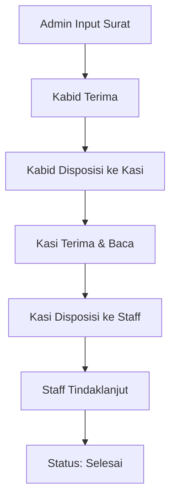
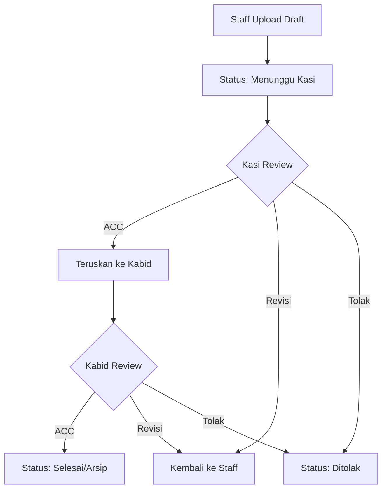
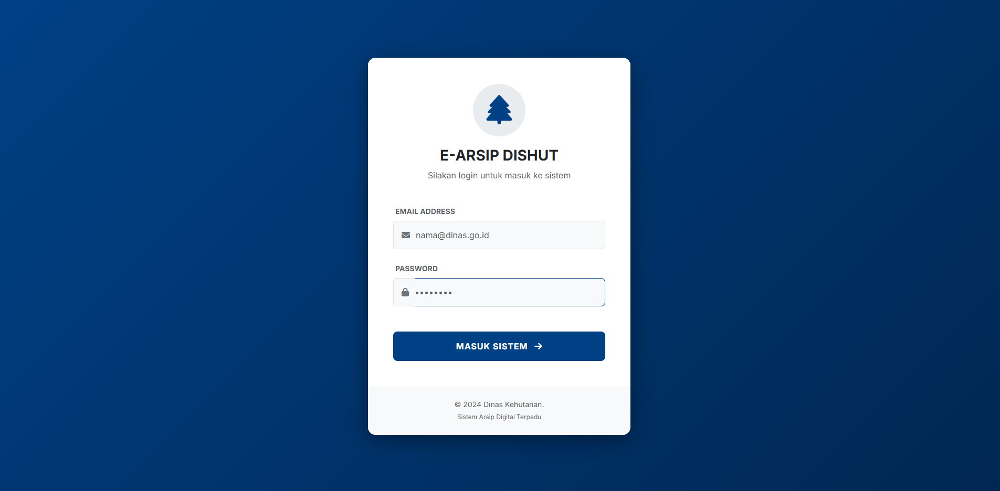
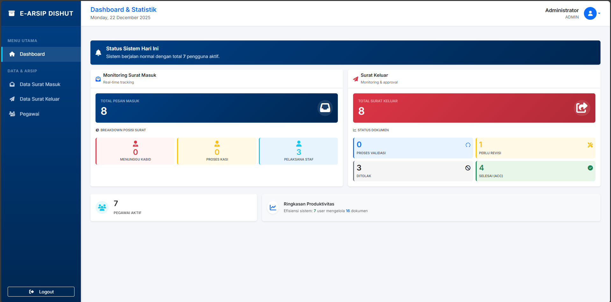
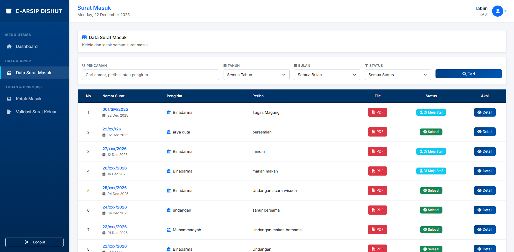
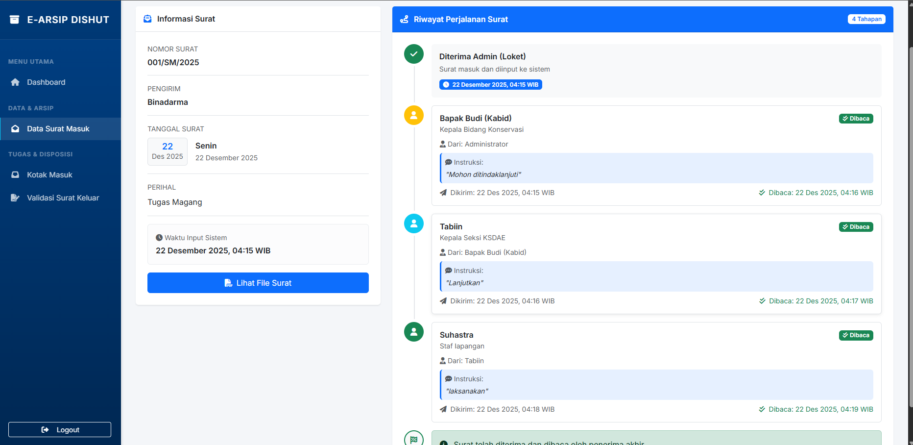
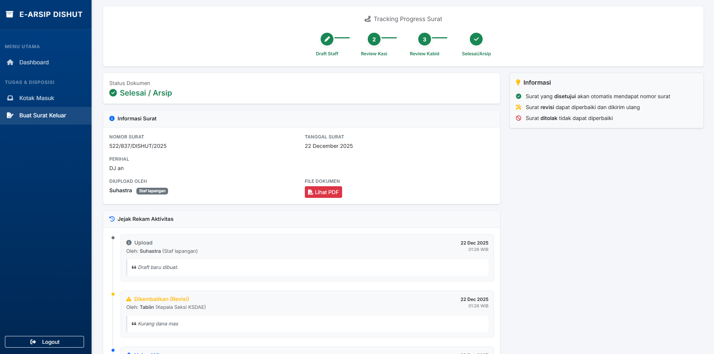
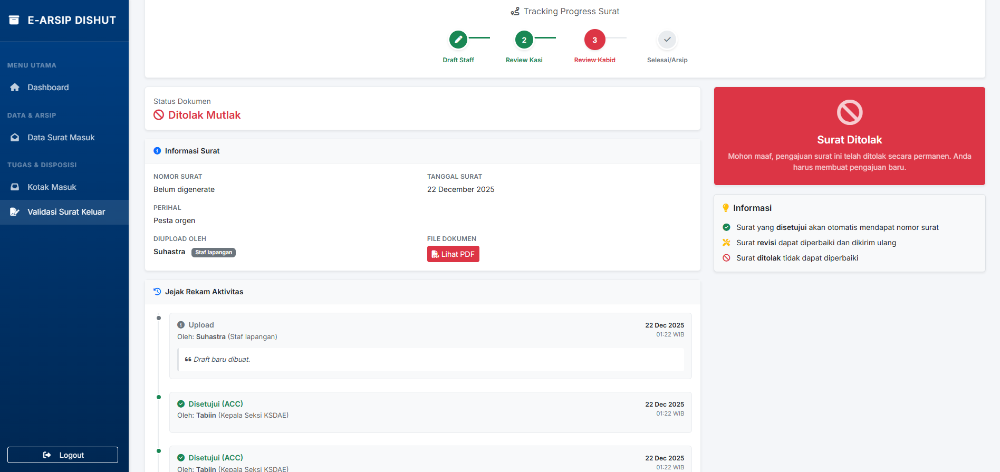

# 📋 Sistem E-Arsip Surat Hierarki

Aplikasi **E-Arsip Surat** untuk mengelola **Surat Masuk** dan **Surat Keluar** dengan alur kerja **hierarki jabatan** (Kabid → Kasi → Staff), fitur **disposisi berjenjang multi-target**, dan **monitoring status posisi surat** secara real-time.

---

## 📑 Daftar Isi

-   [Gambaran Umum](#-gambaran-umum)
-   [Fitur Utama](#-fitur-utama)
-   [Role & Hak Akses](#-role--hak-akses)
-   [Alur Proses](#-alur-proses)
-   [Teknologi](#-teknologi)
-   [Instalasi](#-instalasi)
-   [Akun Demo](#-akun-demo)
-   [Screenshot](#-screenshot)
-   [Keamanan](#-keamanan)
-   [Lisensi](#-lisensi)

---

## 🎯 Gambaran Umum

Sistem ini dirancang untuk kebutuhan pengarsipan surat digital di lingkungan instansi pemerintahan atau organisasi, dengan penekanan pada:

-   ✅ **Hierarki atasan–bawahan** untuk alur disposisi yang realistis dan terkontrol
-   📊 **Tracking progres** real-time untuk monitoring status surat
-   ✔️ **Validasi berjenjang** dengan approval multi-level
-   🔒 **Role-based access control** untuk keamanan data

---

## ✨ Fitur Utama

### 📥 Manajemen Surat Masuk

-   Input metadata surat dengan upload dokumen PDF/DOC/DOCX
-   Disposisi berjenjang: Kabid → Kasi → Staff
-   Tracking status: Menunggu Disposisi / Di Meja Kabid/Kasi/Staff / Selesai
-   Wajib baca sebelum disposisi (read tracking)
-   Multi-target disposisi (bisa kirim ke beberapa penerima sekaligus)

### 📤 Manajemen Surat Keluar

-   Upload draft dari Staff dengan validasi bertingkat
-   Review Kasi → Review Kabid (ACC final)
-   Opsi keputusan: ACC / Revisi / Tolak dengan catatan
-   Notifikasi otomatis untuk setiap perubahan status

### 👥 Role-Based Access Control

-   4 Role: Admin, Kabid (Kepala Bidang), Kasi (Kepala Seksi), Staff
-   Akses halaman dan fitur menyesuaikan role
-   Data terisolasi berdasarkan hierarki

### 🌳 Hierarki Organisasi

-   Struktur parent-child (Kabid → Kasi → Staff)
-   List penerima disposisi otomatis sesuai bawahan langsung
-   Validasi hierarki untuk mencegah disposisi tidak valid

### 🔍 Pencarian & Filter

-   Filter berdasarkan tahun, bulan, status
-   Pencarian nomor surat, perihal, pengirim
-   Active filter badges untuk UX yang lebih baik

### 📊 Dashboard & Statistik

-   Monitoring real-time posisi semua surat
-   Statistik per role (pending, selesai, ditolak, revisi)
-   Ringkasan produktivitas dan efisiensi

---

## 👤 Role & Hak Akses

| Role                         | Hak Akses Inti                                                                                                                         |
| ---------------------------- | -------------------------------------------------------------------------------------------------------------------------------------- |
| **Admin**                    | • Input surat masuk & upload dokumen<br>• Manajemen akun & role<br>• Monitoring semua proses surat<br>• Akses ke semua data sistem     |
| **Kabid**<br>(Kepala Bidang) | • Terima disposisi surat masuk<br>• Disposisi ke Kasi bawahan<br>• Validasi/ACC final surat keluar<br>• View riwayat keputusan         |
| **Kasi**<br>(Kepala Seksi)   | • Terima disposisi dari Kabid<br>• Disposisi ke Staff bawahan<br>• Review & validasi surat keluar dari Staff<br>• Monitoring tugas tim |
| **Staff**<br>(Pelaksana)     | • Terima disposisi dari Kasi<br>• Tindaklanjut surat masuk<br>• Upload draft surat keluar<br>• Revisi surat yang ditolak               |

---

## 🔄 Alur Proses

### 1️⃣ Surat Masuk (Top-Down)



**Detail Proses:**

1. **Admin** input surat masuk + upload dokumen (PDF/DOC/DOCX)
2. Sistem otomatis kirim ke **Kabid** dengan status "Menunggu Disposisi Kabid"
3. **Kabid** wajib baca dulu, baru bisa **disposisi ke Kasi** (pilih 1 atau lebih Kasi)
4. **Kasi** terima disposisi → wajib baca → **disposisi ke Staff** bawahan langsung
5. **Staff** tindaklanjut → saat dibuka, status otomatis menjadi **"Selesai"**

### 2️⃣ Surat Keluar (Bottom-Up)



**Detail Proses:**

1. **Staff** upload draft surat keluar (PDF/DOC/DOCX) + perihal
2. **Kasi** review → opsi: **ACC** / **Revisi** / **Tolak** + catatan
3. Jika ACC → diteruskan ke **Kabid**
4. **Kabid** review → **ACC final** → surat menjadi arsip resmi
5. Jika revisi/tolak → notifikasi ke Staff untuk perbaikan

> 📌 **Catatan Penting:**
>
> -   Setiap level harus membaca dokumen sebelum bisa ambil keputusan
> -   Catatan wajib diisi saat revisi atau tolak
> -   History semua keputusan tersimpan untuk audit trail

---

## 🛠️ Teknologi

### Backend

-   **Laravel 10.x** - PHP Framework
-   **MySQL 8.0** - Database
-   **PHP 8.1+** - Programming Language

### Frontend

-   **Bootstrap 5.3** - CSS Framework
-   **Font Awesome 6.4** - Icons
-   **Flatpickr** - Date Picker
-   **Vanilla JavaScript** - Interactivity

### Tools

-   **Composer** - PHP Dependency Manager
-   **NPM/Node.js** - Frontend Asset Build
-   **XAMPP/Laragon** - Local Development

---

## 📦 Instalasi

### Prasyarat

-   PHP >= 8.1
-   Composer
-   MySQL/MariaDB
-   Node.js & NPM
-   XAMPP/Laragon (untuk Windows)

### Langkah Instalasi

#### 1️⃣ Clone Repository

```bash
git clone https://github.com/suhastra13/Sistem-arsip-surat-hierarki.git
cd Sistem-arsip-surat-hierarki
```

#### 2️⃣ Install Dependencies

```bash
# Install PHP dependencies
composer install

# Install Node dependencies
npm install
```

#### 3️⃣ Setup Environment

```bash
# Copy environment file
copy .env.example .env

# Generate application key
php artisan key:generate
```

#### 4️⃣ Konfigurasi Database

Buat database baru di phpMyAdmin dengan nama `arsip_surat`, lalu edit file `.env`:

```env
DB_CONNECTION=mysql
DB_HOST=127.0.0.1
DB_PORT=3306
DB_DATABASE=arsip_surat
DB_USERNAME=root
DB_PASSWORD=
```

#### 5️⃣ Migrasi & Seeder

```bash
# Run migrations and seeders
php artisan migrate --seed

# Atau jalankan seeder tertentu
php artisan db:seed --class=UserSeeder
```

#### 6️⃣ Create Storage Link

```bash
php artisan storage:link
```

#### 7️⃣ Jalankan Aplikasi

**Terminal 1** - Laravel Server:

```bash
php artisan serve
```

**Terminal 2** - Frontend Assets (opsional jika pakai Vite):

```bash
npm run dev
```

**Akses Aplikasi:**

-   🌐 [http://127.0.0.1:8000](http://127.0.0.1:8000)

---

## 🔑 Akun Demo

Seeder otomatis membuat akun demo berikut:

| Role         | Email            | Password   | Hierarki                     |
| ------------ | ---------------- | ---------- | ---------------------------- |
| 👑 **Admin** | admin@dishut.com | `password` | Administrator sistem         |
| 👔 **Kabid** | kabid@dishut.com | `password` | Kepala Bidang (level 1)      |
| 👨‍💼 **Kasi**  | kasi@dishut.com  | `password` | Kepala Seksi (parent: Kabid) |
| 👤 **Staff** | staf@dishut.com  | `password` | Pelaksana 1 (parent: Kasi)   |
| 👤 **Staff** | staf2@dishut.com | `password` | Pelaksana 2 (parent: Kasi)   |

### Login Testing Flow

1. Login sebagai **Admin** → Input surat masuk
2. Login sebagai **Kabid** → Disposisi ke Kasi
3. Login sebagai **Kasi** → Disposisi ke Staff
4. Login sebagai **Staff** → Baca & tindaklanjut

> ⚠️ **PENTING:** Untuk produksi, **wajib ganti semua password** dan hapus akun demo!

---

## 📸 Screenshot

### 🔐 Login Page



### 📊 Dashboard Admin



### 📥 Daftar Surat Masuk



### 🔍 Monitor Proses Surat (Admin)



### 📤 Monitor Surat Keluar (Staff)



### ❌ Tolak Surat (Kabid)



---

## 🔒 Keamanan

### Untuk Development

-   ✅ Akun demo disediakan untuk testing
-   ✅ File `.env` sudah di-gitignore
-   ✅ Password di-hash dengan bcrypt

### Untuk Production

-   🔴 **WAJIB** ganti semua password default
-   🔴 Hapus atau disable akun demo
-   🔴 Set `APP_DEBUG=false` di `.env`
-   🔴 Gunakan HTTPS
-   🔴 Backup database secara berkala
-   🔴 Update dependencies secara rutin

### Best Practices

```bash
# Generate strong application key
php artisan key:generate

# Clear all caches
php artisan optimize:clear

# Run in production mode
php artisan config:cache
php artisan route:cache
php artisan view:cache
```

---

## 🤝 Kontribusi

Kontribusi sangat diterima! Silakan:

1. Fork repository ini
2. Buat branch fitur (`git checkout -b feature/AmazingFeature`)
3. Commit perubahan (`git commit -m 'Add some AmazingFeature'`)
4. Push ke branch (`git push origin feature/AmazingFeature`)
5. Buat Pull Request

---

## 📝 Lisensi

Proyek ini dibuat untuk kebutuhan **akademik dan demo**. Silakan gunakan dan modifikasi sesuai kebutuhan dengan mencantumkan kredit.

---

## 👨‍💻 Developer

Dikembangkan oleh [Suhastra13](https://github.com/suhastra13)


<div align="center">

**⭐ Jika project ini membantu, jangan lupa beri star! ⭐**

Made with ❤️ using Laravel

</div>
